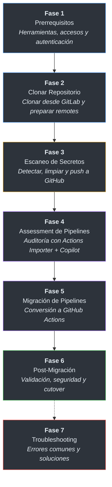
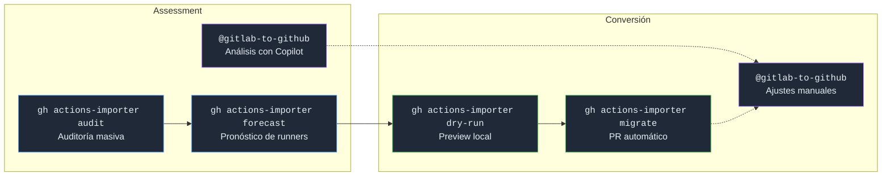
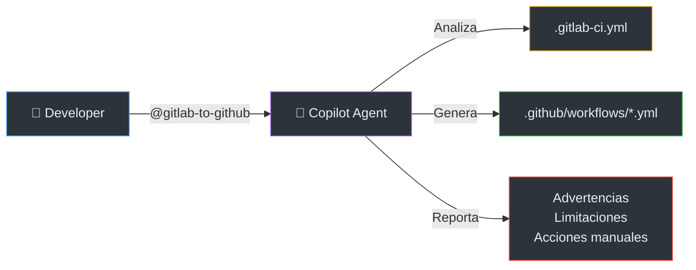

# 🚀 Migración de GitLab a GitHub

## Introducción

Esta guía documenta el proceso completo para migrar **repositorios de código** y **pipelines CI/CD** desde GitLab hacia GitHub. Está diseñada para equipos de DevOps, desarrolladores y líderes técnicos que necesitan ejecutar migraciones de forma segura, repetible y con mínimo riesgo.

### ¿Qué cubre esta guía?

- **Migración de código fuente**: ramas, tags, historial de commits y archivos LFS
- **Escaneo y limpieza de secretos**: detección y remediación antes de hacer push a GitHub
- **Assessment de pipelines**: auditoría automatizada con [GitHub Actions Importer](https://docs.github.com/en/actions/tutorials/migrate-to-github-actions/automated-migrations/gitlab-migration) y análisis asistido con GitHub Copilot
- **Conversión de pipelines**: de `.gitlab-ci.yml` a GitHub Actions workflows
- **Post-migración**: seguridad, permisos, environments y cutover gradual

### ¿Qué herramientas se usan?

| Herramienta | Rol en la migración |
|---|---|
| **GitHub Actions Importer** | Auditoría, forecast y conversión automatizada de pipelines |
| **GitHub Copilot** (`@gitlab-to-github`) | Asistente IA para assessment detallado y ajustes de conversión |
| **gitleaks + BFG** | Escaneo y limpieza de secretos en la historia de commits |
| **GitHub CLI** | Autenticación, gestión de repositorios y operaciones de migración |

---

## 📋 Proceso de Migración

La migración se divide en 7 fases secuenciales. Haz clic en cualquier fase para ir a su documentación:



### Flujo de herramientas para migración de pipelines



---

## ⚡ Quick Start

### Migrar un repositorio (código)

```bash
# 1. Clonar desde GitLab
git clone git@gitlab.com:GRUPO/REPO.git
cd REPO

# 2. Agregar remote de GitHub (NO hacer push todavía)
git remote add github git@github.com:ORG/REPO.git

# 3. Escanear secretos ANTES de hacer push
gitleaks detect --source . --verbose
# Si hay secretos → limpiar con BFG (ver docs/03-secret-scanning.md)

# 4. Push a GitHub (solo después de verificar que no hay secretos)
git push github --all
git push github --tags
```

### Migrar un pipeline (CI/CD) con GitHub Actions Importer

```bash
# 1. Instalar y configurar Actions Importer
gh extension install github/gh-actions-importer
gh actions-importer configure

# 2. Auditar el namespace completo
gh actions-importer audit gitlab --output-dir tmp/audit --namespace MI-NAMESPACE

# 3. Dry-run de un proyecto específico
gh actions-importer dry-run gitlab --output-dir tmp/dry-run --namespace MI-NAMESPACE --project MI-PROYECTO

# 4. Migrar (crea un PR con el workflow convertido)
gh actions-importer migrate gitlab --target-url https://github.com/ORG/REPO --output-dir tmp/migrate --namespace MI-NAMESPACE --project MI-PROYECTO
```

### Complementar con GitHub Copilot

1. Abrir el archivo `.gitlab-ci.yml` en VS Code
2. Invocar el agente de Copilot: **`@gitlab-to-github`**
3. Pegar o referenciar el pipeline y obtener ajustes para items parcialmente convertidos

> Ver [Assessment de Pipelines](docs/04-pipeline-assessment.md) para el proceso completo.

---

## 📖 Documentación detallada

| # | Fase | Documento | Descripción |
|---|---|---|---|
| 1 | Prerrequisitos | [01-prerequisites.md](docs/01-prerequisites.md) | Herramientas, accesos, autenticación y consideraciones para entornos Enterprise (EMU, SAML SSO) |
| 2 | Clonar Repositorio | [02-repository-migration.md](docs/02-repository-migration.md) | Clonar desde GitLab, preparar remotes y métodos de migración |
| 3 | Escaneo y Push | [03-secret-scanning.md](docs/03-secret-scanning.md) | Escanear secretos, limpiar con BFG si es necesario, y push a GitHub |
| 4 | Assessment | [04-pipeline-assessment.md](docs/04-pipeline-assessment.md) | Auditoría automatizada con Actions Importer (`audit`, `forecast`) y análisis con Copilot |
| 5 | Migración de Pipelines | [05-pipeline-migration.md](docs/05-pipeline-migration.md) | Conversión con Actions Importer (`migrate`), ajustes con Copilot, tablas de equivalencias y ejemplos |
| 6 | Post-Migración | [06-post-migration.md](docs/06-post-migration.md) | Checklist de validación, seguridad, protección de ramas, environments y permisos |
| 7 | Troubleshooting | [07-troubleshooting.md](docs/07-troubleshooting.md) | Errores comunes: SAML SSO, push protection, refs rechazados, atribución de commits |

---

## 🤖 Agente de GitHub Copilot

Este repositorio incluye un **agente de GitHub Copilot** (`@gitlab-to-github`) especializado en migración de pipelines GitLab CI/CD → GitHub Actions. Funciona como **complemento** de GitHub Actions Importer para los ajustes que requieren contexto humano.



### Ubicación

```
.github/agents/gitlab-to-github.agents.md
```

### Uso en VS Code

1. Abre VS Code con GitHub Copilot habilitado
2. En el chat de Copilot, invoca el agente: **`@gitlab-to-github`**
3. Adjunta o pega tu archivo `.gitlab-ci.yml`
4. El agente genera:
   - Workflow(s) de GitHub Actions equivalente(s)
   - Reporte de migración con advertencias y limitaciones
   - Instrucciones de implementación

### Capacidades del agente

- Transformación de stages, jobs, variables, rules, services, artifacts y cache
- Mapeo de variables predefinidas de GitLab (`$CI_*`) a contextos de GitHub
- Identificación de features sin equivalente directo
- Aplicación automática de mejores prácticas (versiones pinneadas, permisos mínimos, health checks)
- Reporte detallado de problemas, advertencias y acciones manuales

---

## 🔗 Referencias

- [GitHub Docs: Migrating from GitLab with GitHub Actions Importer](https://docs.github.com/en/actions/tutorials/migrate-to-github-actions/automated-migrations/gitlab-migration)
- [GitHub Docs: Migrating from GitLab CI/CD to GitHub Actions](https://docs.github.com/en/actions/migrating-to-github-actions/manually-migrating-to-github-actions/migrating-from-gitlab-cicd-to-github-actions)
- [GitHub Docs: Importing source code](https://docs.github.com/en/migrations/importing-source-code)
- [GitHub Docs: Extending Actions Importer with custom transformers](https://docs.github.com/en/actions/migrating-to-github-actions/automated-migrations/extending-github-actions-importer-with-custom-transformers)
- [GitHub Docs: Workflow syntax](https://docs.github.com/en/actions/using-workflows/workflow-syntax-for-github-actions)
- [GitHub Actions Importer (source)](https://github.com/github/gh-actions-importer)
- [GitHub Actions Marketplace](https://github.com/marketplace?type=actions)

---

## 📄 Licencia

Este proyecto es una guía de referencia para migración de GitLab a GitHub. Siéntete libre de adaptarlo a las necesidades de tu equipo.

---

<p align="center">
  <i>¿Encontraste un problema? Abre un <a href="../../issues">issue</a> o contribuye con un PR.</i>
</p>
